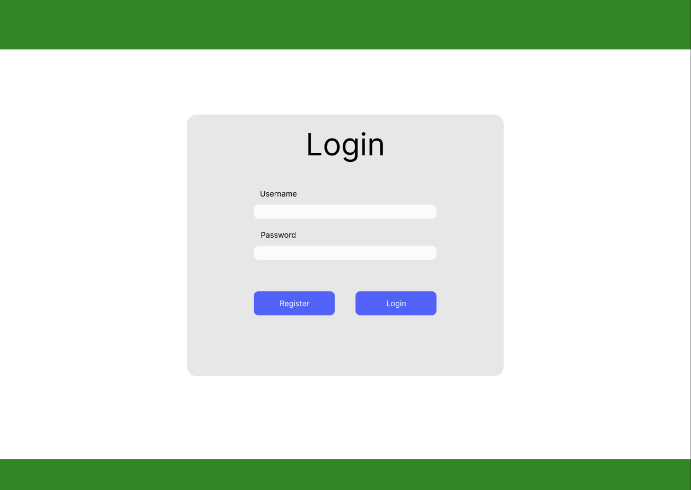
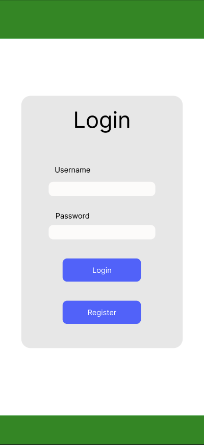
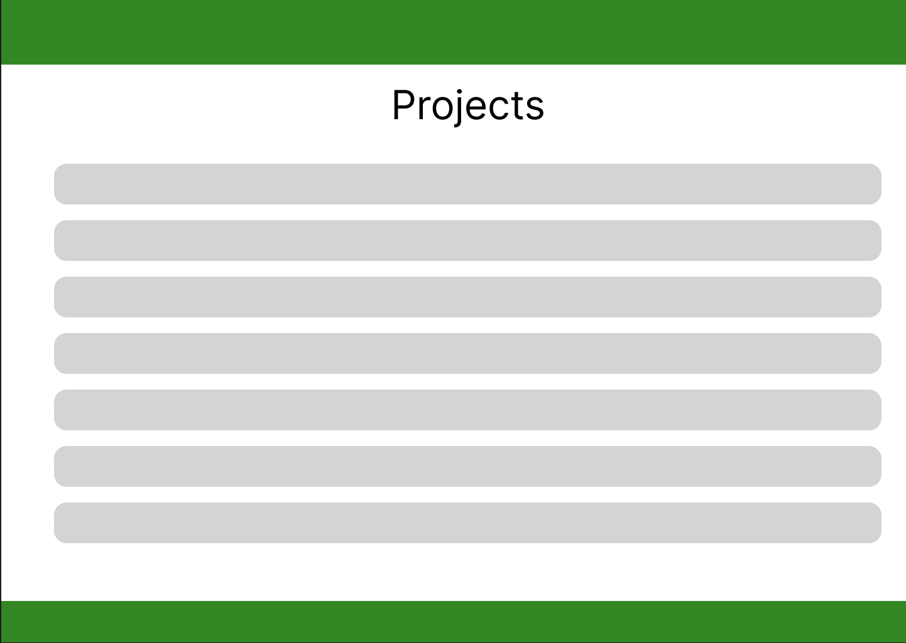
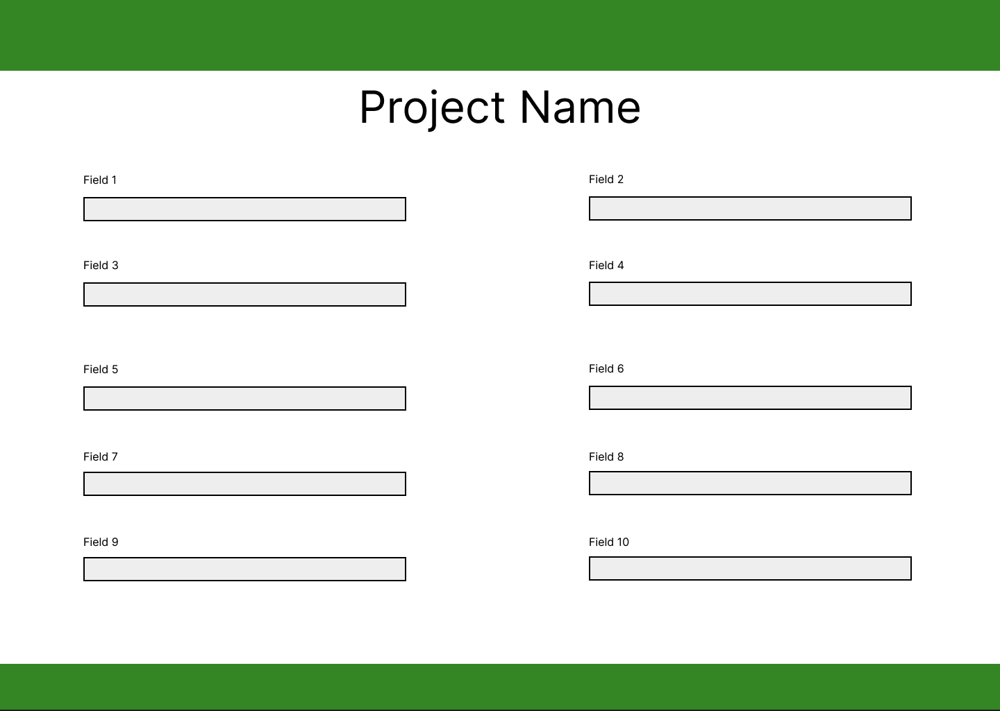
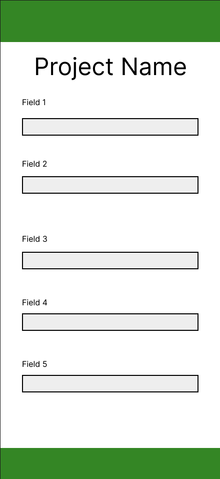
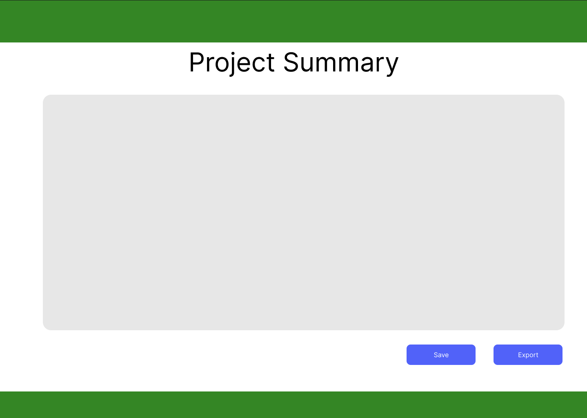
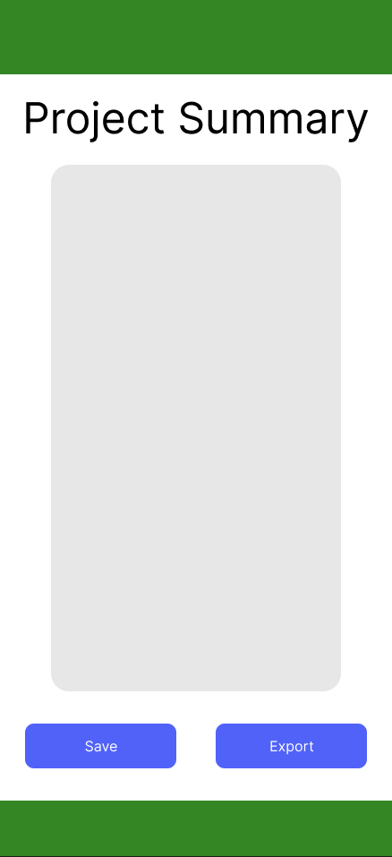
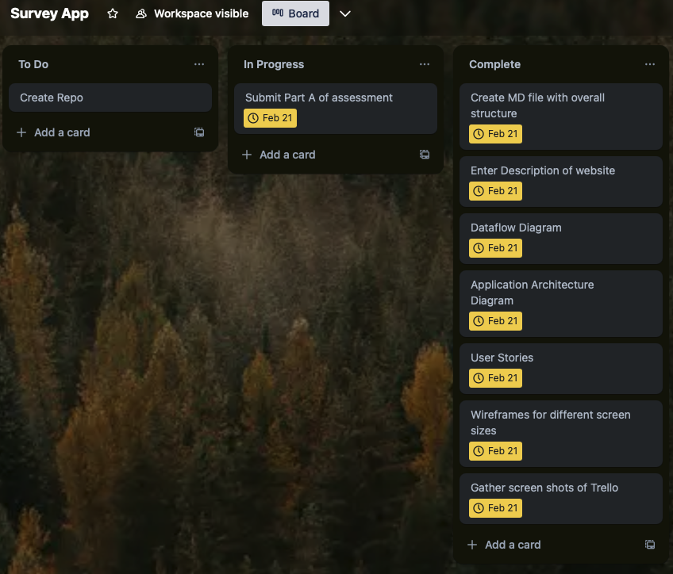

# Survey App
The aim is to solve a real world problem that a local business has. They do tree and vegetation surveys and currently fill the information into spreadsheets while out in the field. This information is then handled multiple times to be put into the right format for the required legislations when back at the office. This is a very time consuming and inefficient process.

The idea is to create an app that can be used to enter all the information into once. This would have full CRUD functionality in a database. This way past projects can be accessed and updated as necessary or multiple projects can be worked on at once. The data would then be output into the correct format.

Overall, this would save lots of time and streamline the process. Besides initially saving time on the data collection and output, updating or deleting information would only require updating in the one place.

## Dataflow Diagram

## Architecture Diagram

## User Stories
1. As a surveyor, I want to quickly enter tree and vegetation data while in the field so that I can efficiently record and store information without needing spreadsheets.

2. As an office staff member, I want to retrieve and update past survey records so that I can make corrections or add new findings. While all data is kept in a singular location and updated in the correct locations to reduce rehandling of data.

## Wireframes
### Login Page
 

### Project Overview

### Project Edit Page

### Project Summary Page

## Trello Board
